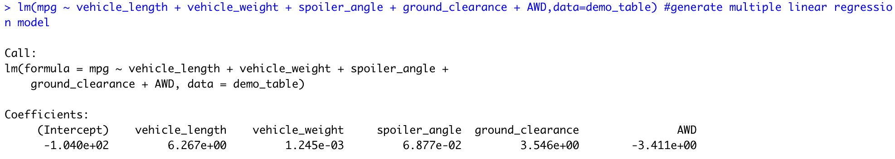
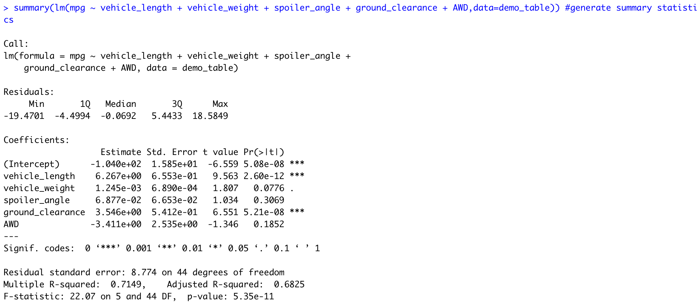
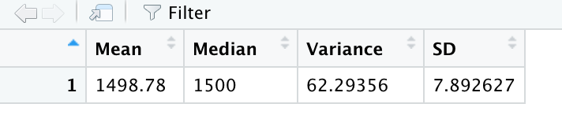
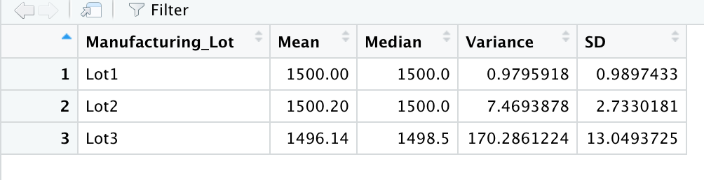
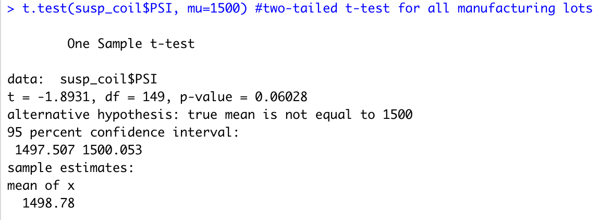
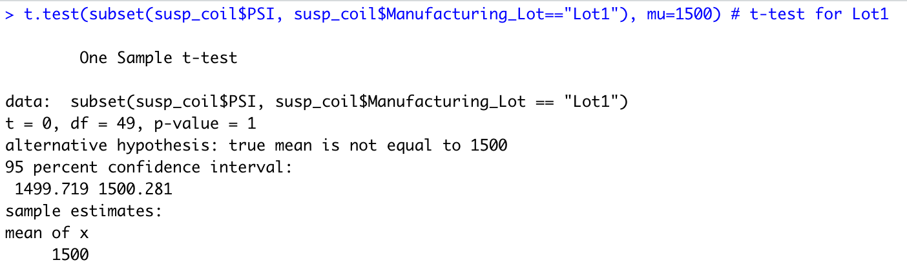
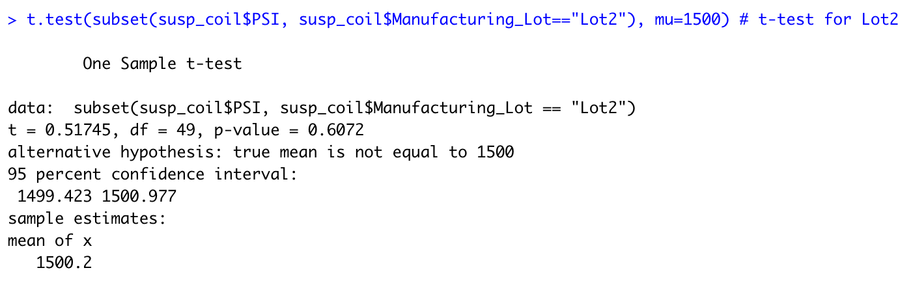
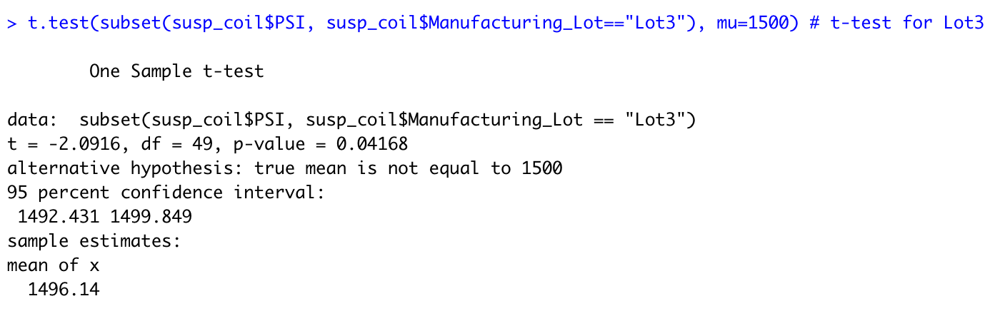

# MechaCar Statistical Analysis

## Linear Regression to Predict MPG

* **vehicle_length** and **ground_clearance** provided a non-random amount of variance to the mpg values in the dataset
* slope of linear model not considered to be zero because the model's r-squared value is 0.7149, which is a result of the vehicle_length and ground_clearance's significant impact on the mpg -- linear model wouldn't be a flat line with a slope of zero 
* the linear model predicts mpg of MechaCar prototypes effectively because the r-squared value is 0.7149, which is a reasonable value for a metric that describes how well the model fits the observed data

## Summary Statistics on Suspension Coils

* current manufacturing data meets the design specification for all manufacturing lots in total because its variance is under 100 pounds/square inch (62 pounds per square inch)
* current manufacturing data meets the design specification for Lots 1 and 2 because their variances are under 100 pounds/square inch (1 pound and 7 pounds, respectively)
* however, the current manufacturing data does not meet the design specification for Lot 3, because its variance is 170 pounds/square inch

## T-Tests on Suspension Coils

### All lots

* the mean PSI for all manufacturing lots is not statistically different from the population mean 
* p-value is over 0.05 (0.06028)

### Lot 1

* the mean PSI for Lot 1 is not statistically different from the population mean 
* p-value is over 0.05 (1), which means that the mean PSI for Lot 1 is equal to the population mean 

### Lot 2

* the mean PSI for Lot 2 is not statistically different from the population mean 
* p-value is over 0.05 (0.6072)

### Lot 3

* the mean PSI for Lot 3 is **statistically different** from the population mean 
* p-value is under 0.05 (0.04168)

## Study Design: MechaCar vs Competition

_Metric to be tested_:
* average safety rating (as administered by the National Highway Traffic Safety Administration (NHTSA))

_Hypotheses_:
* Null hypotheses: 
  * There is no statistical difference between the average safety rating for MechaCar and the average safety rating for our competition, which would suggest that there is no difference between both car companies in their performance 
* Alternative hypothesis:
  * There is a statistical difference between the average safety rating for MechaCar and the average safety rating for our competition

_Statistical test_:
* Two-sample t-test 
  * this test is used to test the statistical difference between the distribution means from two samples (MechaCar and Competition)
  * data type is numerical (safety rating is given from 1-5) 

_Data needed_:
* Data scraping from NHTSA website for safety rating for all models of MechaCar and of the competition
